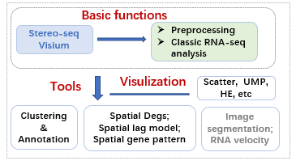

  
## **Stereopy**: Spatial transcriptomics analysis in Python

[Installation](https://stereopy.readthedocs.io/en/latest/General/Installation.html) - [Quick start](https://stereopy.readthedocs.io/en/latest/Tutorials/quick_start.html) - [Documentation](https://stereopy.readthedocs.io/en/latest/index.html) - [API](https://stereopy.readthedocs.io/en/latest/api/index.html)

stereopy is a tool for the analysis and visualization of spatial transcriptomics data, such as stereo-seq data.
It provides a series of analysis of spatial omics, and will be added to the tissue image related analysis later.
Maybe the performance of this version is not optimal, and we will improve performance and calculation efficiency, and can support a large number of analyses in the future. 
## Discussion 
Please use github issue tracker to report coding related [issues](https://github.com/BGIResearch/stereopy/issues) of stereopy.

## Contribution 
Contributions to stereopy are highly welcome! The contributing guide will be updated later.
